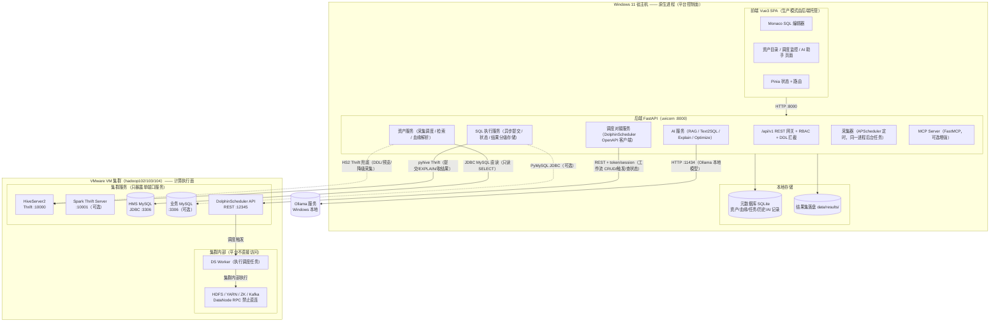
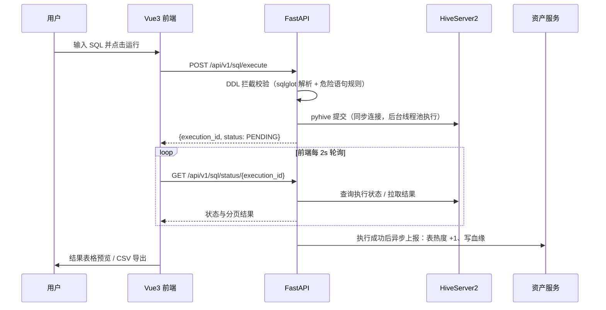
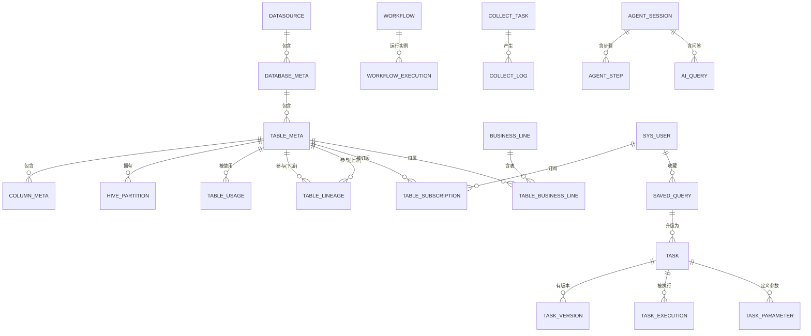

# 一站式数据开发平台 · 本地架构设计方案

> 版本：v1.0（设计稿，不含业务代码）
> 适用场景：Windows 11 宿主机 + VMware 3 节点大数据集群（hadoop102/103/104），单机自用
> 前置阅读：`refrence/` 目录下 4.1.1 ~ 4.1.5 五份需求设计文档（涤生大数据课程）

---

## 0. 文档说明与差异声明

本方案完全承接 `refrence/` 五份文档的功能设计与数据模型设计（功能编号 A/B/C/D 全部沿用），但在以下 6 个点上因"单机自用、Windows 宿主机、资源受限、不改集群"的现实约束做了**明确偏离**。凡偏离处均在正文标注「与参考文档差异」。

| # | 项 | 参考文档原设计 | 本方案 | 偏离原因 |
|---|---|---|---|---|
| 1 | 部署方式 | Docker + Docker Compose | Windows 原生进程 + PowerShell 脚本 | 单机自用无隔离需求；Windows 上 Docker 额外占用资源；原生脚本更简单可控（详见第 6 章） |
| 2 | 调度引擎 | 自研轻量调度（APScheduler + 自研 DAG 引擎，4.1.4） | 复用 VM 上已有 DolphinScheduler（OpenAPI 对接），**不再部署第二套调度引擎** | 用户硬性约束；DS 已具备 DAG/Cron/重试/告警，重复造轮子既浪费又不改集群原则 |
| 3 | 前端技术栈 | Next.js + React + TypeScript | Vue3 + Vite + TypeScript | 用户指定对比项；国内生态成熟、对数据密集后台支持好（详见 5.1） |
| 4 | 元数据库 | MySQL | MVP 用 SQLite，可平滑切换本地 MySQL/MariaDB | 2GB 内存硬约束 + 单用户低并发；SQLAlchemy 抹平差异（详见 5.2） |
| 5 | AI 模型 | Claude API（云端） | Ollama 本地模型（主）+ 云端 API 可选增强 | 本地离线可用、无订阅成本、数据不出本机；模型路由接口预留，未来可切云端（详见 5.3.4） |
| 6 | AI ETL Agent | 11 个子 Agent 的完整 Orchestrator + 沙箱（4.1.5 D05-D20） | MVP 裁剪为"单 Agent + 顺序执行 + 人审门"，完整 Orchestrator 列为可选增强 | 本地 2GB 预算与个人使用场景下，11 子 Agent 架构过度设计（详见 5.3.4） |

**说明**：本方案中"调度"与参考文档 4.1.4 的职责边界不变——平台侧仍然管理"任务定义 / 版本 / 试运行 / 参数"，只是把"Cron 触发 / DAG 编排 / 失败重试 / 告警"这四件事委托给 DS 执行（4.1.4 中 C03/C04/C05 由 DS 承担）。

---

## 1. 设计总览与核心取舍

### 1.1 一句话定位

平台 = **Windows 上的"管、写、调、问"控制面**；VM 集群 = 唯一的**计算与存储执行面**。
本地平台**不做任何计算**，所有 SQL 与作业下发到集群执行。

### 1.2 四大能力与责任划分

| 能力 | 平台侧（Windows）负责 | 集群侧（VM）负责 |
|---|---|---|
| 数据资产管理 | 元数据采集调度、资产存储/检索/展示、血缘解析 | 提供 HMS MySQL（只读）、HS2（兜底） |
| SQL 在线开发 | 编辑器、执行提交、状态轮询、结果展示、历史 | 真正执行 SQL（Hive/Spark/MySQL） |
| 任务调度 | 任务定义/版本/试运行、DS OpenAPI 封装、状态展示 | DolphinScheduler 负责 Cron/DAG/重试/告警 |
| AI 智能层 | Text2SQL、SQL 解释/优化、慢 SQL 诊断、字典生成、RAG | 提供 EXPLAIN、结果集（经 HS2） |

### 1.3 三条铁律（贯穿全文）

1. **不碰 HDFS 客户端**：Windows 侧严禁初始化 Hadoop/HDFS 客户端、严禁直连 DataNode RPC 端口（NameNode 会回传 DataNode hostname，Windows 无法解析 → 能 ls 但读写卡死）。所有数据访问只走 HS2（Thrift/JDBC）与 HMS MySQL（JDBC）这两个单端口服务。
2. **不改集群**：不修改 VM 上任何组件配置、不删除/覆盖任何数据。新增只读账号视为"新增对象"而非"修改配置"，但仍需人工确认后执行。
3. **内存红线 2GB**：平台自身（不含 Ollama 模型进程）常驻内存 ≤ 2GB，预算见下表。

### 1.4 内存预算（平台自身，不含 Ollama）

| 进程 | 估算常驻内存 | 说明 |
|---|---|---|
| 后端 uvicorn（含采集器、执行器线程池） | 150 ~ 300 MB | 单 worker，SQLAlchemy + pyhive 连接池 |
| 前端 vite dev（仅开发模式） | 200 ~ 400 MB | 生产模式为 0（FastAPI 托管静态资源） |
| SQLite / 文件存储 | ≈ 0 | 无独立进程 |
| 可选：本地 MySQL/MariaDB（Phase 5 起） | 300 ~ 500 MB | 若选择切换元数据库，预算需重算 |
| 可选：chromadb 向量库 | 150 ~ 250 MB | AI RAG 增强，Phase 6 评估 |
| 合计（MVP，生产模式） | ≤ 0.6 GB | 远低于 2GB 红线，预留扩展空间 |

---

## 2. 环境探测清单（Phase 0 必做，动手前先跑）

> 原则：**版本以实际探测为准**，本方案所有"端口/路径/账号"均为参考值，最终以探测结果为准。
> 所有命令在 VM（Linux）与 Windows 两端执行，结果记录到 `docs/环境探测结果.md`（建议建一个）。

### 2.1 VM 侧（三台机器分别执行）

```bash
# ① 基本信息
hostname && hostname -I
cat /etc/os-release | head -3

# ② 组件版本（命令以集群实际安装方式为准，找不到安装目录先 which）
hadoop version 2>&1 | head -5
hive --version 2>&1 | head -5
spark-submit --version 2>&1 | grep -i version | head -3
flume-ng version 2>&1 | head -3
kafka-topics.sh --version 2>&1 | head -3
superset version 2>&1 | head -3
# DataX：cat 安装目录下 version 文件（如 datax/lib/*.jar 里的版本号）
# DolphinScheduler：cat $DS_HOME/... 或 ps 参数确认版本；也可访问 UI 查看

# ③ 关键端口监听（确认集群侧各服务在哪个 IP 上监听）
ss -tlnp 2>/dev/null | grep -E ':10000|:9083|:3306|:8020|:9000|:9870|:8088|:19888|:12345|:5176|:8888|:2181|:9092|:10001|:10002'
# 重点确认：HiveServer2(10000) / Metastore Thrift(9083) / MySQL(3306) / DS api(12345)

# ④ Hive 配置定位（HMS 连接信息、HS2 端口）
find / -name "hive-site.xml" 2>/dev/null
# 在 hive-site.xml 中确认：
#   javax.jdo.option.ConnectionURL        -> HMS 的 MySQL JDBC 地址（库名、host、端口）
#   javax.jdo.option.ConnectionUserName   -> HMS 账号
#   hive.server2.thrift.port              -> HS2 端口
#   hive.metastore.uris                   -> HMS Thrift 地址

# ⑤ HMS MySQL 账号情况（确认是否有只读账号可用；无则后续申请）
mysql -u root -p -h <HMS-HOST> -e "SELECT user, host FROM mysql.user;"
# 注意：不能盲改任何配置，只做 SELECT 探测

# ⑥ DolphinScheduler API 探测（确认版本与 API 端口）
ps -ef | grep -i dolphinscheduler | grep -i api
# 3.x 默认 API 端口 12345，UI 端口 5176/8888（以实际为准）
curl -s http://127.0.0.1:12345/dolphinscheduler/actuator/health 2>/dev/null

# ⑦ 集群业务 MySQL（作为 SQL 在线开发的 MySQL 数据源，可选）
mysql -u root -p -h <hadoop102> -e "show databases;"   # 只看，不改

# ⑧ Spark Thrift Server 是否存在（可选增强前置探测）
ps -ef | grep -i thriftserver | grep -v grep
```

### 2.2 Windows 侧（宿主机）

```powershell
# ① 可用内存
[math]::Round((Get-CimInstance Win32_ComputerSystem).TotalPhysicalMemory/1GB,1)

# ② 运行环境
python --version; node --version; npm --version

# ③ 到 VM 连通性（把 hadoop102-ip 换成探测出的实际 IP）
Test-NetConnection <hadoop102-ip> -Port 10000
Test-NetConnection <hadoop102-ip> -Port 3306
Test-NetConnection <hadoop102-ip> -Port 12345

# ④ VMware 网络模式判断（NAT=VMnet8 / 桥接=物理网卡）
ipconfig /all | findstr -i "VMnet"

# ⑤ 本机规划端口占用检查
Get-NetTCPConnection -State Listen -ErrorAction SilentlyContinue |
  Where-Object { $_.LocalPort -in 8000,5173,11434,8080 } | Select LocalPort,OwningProcess

# ⑥ 确认 Windows hosts 是否已有集群主机名解析（可选，见第 8 章风险 R1）
notepad C:\Windows\System32\drivers\etc\hosts
```

### 2.3 探测结果 → 设计决策的映射

| 探测结果 | 影响的设计决策 |
|---|---|
| 网络模式 = NAT | 需确认 VMware 端口转发，或平台统一走"IP 直连 + 集群内部互通"策略（见 3.2） |
| 网络模式 = 桥接 | 平台直接 IP 访问，最简单 |
| HMS MySQL 允许远程连接 + 有只读账号 | 资产采集走 HMS 直读（主路径，性能最优） |
| HMS MySQL 仅监听 127.0.0.1 | 降级走 HS2 全量拉取（慢），或申请新增只读账号（见 8 章 R4） |
| DS 版本 = 3.x | OpenAPI 用 token 认证 + 新接口路径 |
| DS 版本 = 2.x | OpenAPI 用 sessionId 认证 + 旧接口路径 |
| Spark Thrift Server 在跑 | Spark 引擎可直接纳入 SQL 开发（可选增强） |
| 未跑 STS | Spark 引擎后置（Phase 6 评估），MVP 只接 Hive |

---

## 3. 整体架构图

### 3.1 架构总览（Mermaid）



### 3.2 网络与 hostname 策略（关键设计）

- **平台与集群之间全部用 IP 直连，不依赖 hostname 解析**。HS2 的 Thrift、HMS 的 MySQL、DS 的 API 都是"单端口、无回调"协议，连接发起方是 Windows，服务端只做应答，不会回传集群内部 hostname 给客户端做二次连接 → 不存在"能连上但卡死"的问题。
- **唯一会回传 hostname 的协议是 HDFS 客户端**（NameNode 返回 DataNode hostname），因此平台全栈禁用 HDFS 客户端（铁律 1）。
- 若为 NAT 模式：需要确认 VM 侧这些端口是否暴露到宿主机（VMware 端口转发或改用桥接）。**推荐桥接**，探测时确认。
- 若平台侧未来确实需要"按表浏览 HDFS 路径"，一律降级为"读 HMS 的 SDS.LOCATION 字段展示路径字符串"，不做实际文件操作。

### 3.3 一次"即席查询"的请求流转（与参考文档 4.1.3 对齐）



---

## 4. 端口与对接矩阵

> 下表端口均为**参考值**，必须经第 2 章探测确认后填实。

### 4.1 平台侧（Windows）端口规划

| 服务 | 端口 | 协议 | 说明 |
|---|---|---|---|
| FastAPI 后端 | 8000 | HTTP | 唯一对外的平台 API；生产模式同时托管前端静态资源 |
| Vite dev server | 5173 | HTTP | 仅开发模式；生产模式关闭 |
| Ollama | 11434 | HTTP | 独立进程，不属于平台（2GB 预算之外） |
| MCP Server | 8080 | HTTP/SSE | 可选增强，供 MCP 客户端对接 |

### 4.2 平台 ↔ 集群对接矩阵

| 能力 | 集群目标服务 | 协议 | 端口（参考） | 需要 hostname 解析？ | 认证方式 | 备注 |
|---|---|---|---|---|---|---|
| 资产采集（主） | HMS MySQL | JDBC/MySQL | 3306 | 否（IP 直连） | 只读账号 | 仅 SELECT，禁写（铁律 2） |
| 资产采集（兜底）/ DDL / 预览 | HiveServer2 | Thrift | 10000 | 否（IP 直连） | Hive 账号 | pyhive |
| SQL 执行（Hive 引擎） | HiveServer2 | Thrift | 10000 | 否（IP 直连） | Hive 账号 | 平台执行器主通道 |
| SQL 执行（Spark 引擎，可选） | Spark Thrift Server | Thrift | 10001/10002 | 否（IP 直连） | Hive 账号 | 需探测是否部署 |
| SQL 执行（MySQL 数据源） | 业务 MySQL | JDBC/MySQL | 3306 | 否（IP 直连） | 业务账号 | 可选数据源 |
| 任务调度（创建/触发/查询） | DolphinScheduler API | REST | 12345 | 否（IP 直连） | token / sessionId | 版本差异见 5.3.3 |
| AI 推理 | Ollama（本机） | HTTP | 11434 | 本机 | 无 | 本地模型 |
| 禁忌：HDFS 文件操作 | NameNode/DataNode RPC | Hadoop RPC | 8020/9864 | **必然需要** | Kerberos/Simple | **全栈禁用**（铁律 1） |

### 4.3 端口冲突避免

- Windows 侧与 VM 侧分属不同网络栈，无直接冲突；冲突只发生在 Windows 侧内部（8000/5173/11434/8080）。
- `start.ps1` 启动前先执行端口占用检查（见 6.4），占用则报错退出，不强制占用。
- 若 8000 被占（如常见本地服务），通过环境变量 `DATAFLOW_PORT` 改端口，前端代理与后端静态托管地址同步调整。

---

## 5. 技术选型方案

### 5.1 后端技术栈对比（用户指定维度：接 Hive JDBC / 做 AI / 控内存）

| 维度 | Python FastAPI + SQLAlchemy + Vue3 | Java Spring Boot 3 + MyBatis-Plus + Vue3 |
|---|---|---|
| 接 Hive | pyhive（Thrift）直连 HS2，官方维护、用法简单；SQLAlchemy 有 pyhive/impyla dialect 可无缝进 ORM；也可用 JayDeBeApi 桥接 JDBC 驱动 | Hive JDBC 驱动官方（org.apache.hive:jdbc），DriverManager 直接用，对"JDBC 语义"最贴近 |
| 做 AI / Text2SQL | **明显优势**：langchain/openai 客户端、RAG 工具链、向量库、sqlglot、数据清洗生态全在 Python，AI 层全部原生 | 需引 spring-ai、HTTP 封装，生态较薄，写 prompt/解析/评测都要自己搭 |
| 控内存 | 常驻 150~300MB，可精确控制进程数 | Spring Boot 3 + WebMVC 起步 ~300-500MB（JVM 堆 + 元空间），单实例就吃掉大半 2GB 预算 |
| 开发效率（个人项目） | 快：ORM + FastAPI 自动文档 + 脚本化采集 | 中：样板代码多、构建慢 |
| 异步执行模型 | asyncio + 线程池跑同步 pyhive，天然适合"提交-轮询" | 虚拟线程（JDK21）也可行，但多一步配置 |
| 与参考文档一致性 | 与 4.1.1 技术栈汇总（FastAPI）一致 | 偏离 |

**结论：选 Python FastAPI + SQLAlchemy。**
理由：接 Hive 两种都行；但 AI/Text2SQL 是平台核心差异化（D02-D04），Python 生态是决定性优势；2GB 内存约束下 Java 的常驻成本不可接受；且与参考文档技术选型一致，降低实现成本。

> **与参考文档差异**：前端由 Next.js/React 改为 **Vue3 + Vite + TypeScript**。理由：Vue3 是用户指定对比项；Element Plus 对"表格 + 表单 + 抽屉 + 标签页"的数据密集后台支持成熟；Monaco Editor 是编辑器业界标准、与前端框架无关（4.1.3 选 Monaco 的结论不变）；Pinia + Vue Router 的 SPA 路由模型完全支撑 4.1.3 的"单平台 Shell"主张。

### 5.2 元数据库对比

| 维度 | 复用 VM 上已有 MySQL | Windows 本地新装 MySQL/MariaDB | PostgreSQL（本地） | SQLite（本地） |
|---|---|---|---|---|
| 部署成本 | 零 | 中（安装 + 服务注册 + 初始化） | 中 | **零（无进程）** |
| 内存占用 | 0（在 VM 侧） | 300~500MB（挤占 2GB） | 150~300MB | **≈0** |
| 与 HMS 共用实例风险 | **高**：平台库与 HMS 账本同实例，一旦误操作（如误 drop）波及生产元数据，且违反"不改集群"精神 | 无 | 无 | 无 |
| 连接信息可控性 | 依赖探测出的账号权限，密码留存于平台库（AES） | 完全可控 | 完全可控 | 完全可控 |
| 性能（几千表元数据 + LIKE 搜索） | 优 | 优 | 优 | **足够**（个人单机、低并发） |
| 并发写 | 优 | 优 | 优 | 单写多读（个人场景足够） |
| 迁移成本 | — | — | — | SQLAlchemy 换连接串 + 少量方言 SQL 调整，成本低 |

**结论：MVP（Phase 1-4）用 SQLite。**
理由：2GB 红线内 SQLite 零成本；平台是单用户低并发，SQLite 的"单写多读"完全够用；参考文档 4.1.2 强调"MySQL LIKE 搜索即可"在 SQLite 上同样成立（LIKE 语法兼容）。当出现以下任一信号再切换本地 MySQL/MariaDB：多人使用、需要 WebSocket 高频写、需要成熟备份运维——切换代价仅是 SQLAlchemy 连接串 + 方言适配，元数据表结构不变。

> 不建议复用 VM MySQL：与 HMS 账本同实例的运维风险 + 账号权限不可控 + 与"不改集群"约束的精神冲突。

### 5.3 四大能力选型

#### 5.3.1 数据资产管理

| 候选 | 说明 | 结论 |
|---|---|---|
| **A. 自研采集器（HMS 直读 + HS2 兜底）** | SQLAlchemy 直连 HMS MySQL 拉 DBS/TBLS/SDS/SERDES/TABLE_PARAMS 等（参考文档 4.1.2 的 JOIN 草图）；血缘用 sqlglot 解析执行过的 SQL + 视图 text；检索用 SQLite LIKE + 过滤 | ✅ **选中** |
| B. OpenMetadata / DataHub | 需要 Elasticsearch + 多服务常驻，远超 2GB；单机自用杀鸡用牛刀 | ❌ 用户硬性约束明确排除 |
| C. Apache Atlas | 依赖 ES + Kafka + 大量 Hook 采集，重型且需改集群侧 Agent | ❌ 排除 |

**【为什么选 A】** 参考文档 4.1.2 已论证"HMS 直读性能与信息完整度双优"；SQLAlchemy 兼容 SQLite 元库与 HMS MySQL 源库，一套 ORM 双库；sqlglot 是纯 Python 解析器（D17 静态验证也复用它），与 AI 层共享。
**【为什么本地可行】** 采集器是 FastAPI 进程内的 APScheduler 后台任务，无额外进程；HMS 直读一条 JOIN 全量拉取，几百表规模秒级完成（参考文档 3500 表目标 30 分钟，本地规模远小于此）；无 ES、无独立服务。
**【如何与集群对接】** `DataSource` 表存 HMS 的 JDBC URL + 只读账号（AES 加密）；采集任务按 `transient_lastDdlTime` 增量拉取（参考文档 7.3 时间戳过滤）；HS2 兜底用于 SHOW CREATE TABLE、数据预览、以及"HMS 不可远程连接"的降级采集。
**关键前置**：HMS 只读账号可用性 → 探测项（见 8 章 R4）。

#### 5.3.2 SQL 在线开发

| 候选 | 说明 | 结论 |
|---|---|---|
| **A. 自研（Monaco + FastAPI 异步执行）** | Monaco Editor（4.1.3 结论不变）+ pyhive 执行器 + 结果分级存储 + 轮询 | ✅ **选中** |
| B. 部署 Apache Hue | 参考文档已论证其是"开源时代经典"，但前端耦合老、AI 内联建议改造难、与单平台 Shell 冲突 | ❌ 排除 |
| C. 全开源拼装（Hue + 独立网关） | 引入无关复杂度，且与"单平台体验"主张矛盾 | ❌ 排除 |

**【为什么选 A】** Monaco 是 VS Code 同源，AI 内联补全钩子原生（4.1.3 §7.1 结论）；自研执行器只需实现"提交/状态/结果"三接口（4.1.3 §三 可扩展性），扩展 Spark/MySQL 数据源成本低。
**【为什么本地可行】** 执行器 = 后端进程内线程池（pyhive 是同步库，用 `ThreadPoolExecutor` 跑，配合 asyncio 对外异步），无独立进程；结果分级存储：小结果入库、大结果落盘 `data/results/`（4.1.3 §7.3）。
**【如何与集群对接】** 唯一通道是 HS2 Thrift（10000 端口，IP 直连）；EXPLAIN 走同一通道；DDL 拦截在 API 层用 sqlglot 解析（第一道），数据源账号只授 SELECT（第二道，铁律 2）。
**风险提示**：pyhive 与 Hive 版本兼容性 → 探测项；若 pyhive 与集群 Hive 2.x 有兼容问题，备用方案为 JayDeBeApi 桥接官方 Hive JDBC 驱动（见 8 章 R6）。

#### 5.3.3 任务调度

| 候选 | 说明 | 结论 |
|---|---|---|
| **A. 复用 DolphinScheduler OpenAPI** | 平台封装 DS REST API：项目/工作流定义 CRUD、触发执行、查询实例状态；调度 UI 复用 DS 自带界面或平台内展示 | ✅ **选中**（硬性约束） |
| B. 自研轻量调度（APScheduler + DAG 引擎） | 参考文档 4.1.4 原设计，但违反"不允许再部署第二个调度引擎" | ❌ 排除 |

**【为什么选 A】** DS 已具备 Cron/DAG/失败重试/告警/补数等完整调度能力，且在集群内运行（任务在 VM 内执行，数据不跨网络）；平台只需做"薄封装"，把 4.1.3 的任务定义 → 生成 DS 工作流定义 JSON → OpenAPI 推送。
**【如何与集群对接】**
- 认证：DS 3.x 用 `POST /dolphinscheduler/token/generate` 生成 token（或 login 拿 sessionId，版本差异见探测项）；请求头 `token: <token>`。
- 创建：`POST /dolphinscheduler/projects` → `POST /dolphinscheduler/projects/{code}/process-definition`（body 为工作流 JSON：任务节点 + 依赖边 + Cron）。
- 触发/查询：`POST .../process-instances` 手动触发；`GET .../process-instances` 查实例状态；平台监控页轮询渲染。
- 参数注入：DS 支持 `${biz_date}` 等全局参数，与 4.1.3 B21 任务参数表对齐（平台存参数定义，推送 DS 时映射为全局参数）。
**平台侧保留的调度职责**：任务定义（Task/TaskVersion）、试运行（平台执行器跑一次）、工作流定义生成器（JSON 模板）、执行状态拉取与展示、告警 Webhook 接收（DS 告警 → 平台通知页）。**不做**：Cron 计算、DAG 拓扑执行、重试调度——全部交给 DS。
**接口差异提示**：DS 2.x 与 3.x 的 API 路径与认证方式不同，Phase 4 开工前必须完成版本探测。

#### 5.3.4 AI 智能层

| 候选 | 说明 | 结论 |
|---|---|---|
| **A. Ollama 本地模型 + 自研 AI 服务** | qwen2.5-coder:7b 或 deepseek-r1:8b（量化）跑 Text2SQL/Explain/Optimize；RAG 用 SQLite 元数据 + LIKE 检索构造上下文（MVP 不建向量库）；可选 FastMCP 暴露工具 | ✅ **选中** |
| B. 云端 Claude API（参考文档 4.1.5 原设计） | 效果上限高，但依赖网络与订阅；本地离线不可用 | 保留为**可选增强**（Phase 6） |
| C. Dify / FastGPT | 重型平台，内存超预算，且与"自研平台"定位重复 | ❌ 排除 |

**【为什么选 A】** 本地模型离线可用、零订阅成本、数据不出本机；qwen2.5-coder 系列在 SQL 生成上对中文场景有较好表现；Ollama 提供 OpenAI 兼容 API（`/v1/chat/completions`），平台 AI 服务通过标准接口调用，未来切云端 Claude 只需改模型路由配置（参考文档 4.1.5 §7.6 模型路由思想保留）。
**【为什么本地可行】** AI 服务 = 后端进程内的一个模块（调 Ollama HTTP），Ollama 模型进程独立于 2GB 预算之外；RAG 的 MVP 实现不引入向量库（元数据就几千行，LIKE 检索 + prompt 拼接足够），chromadb 作为 Phase 6 可选增强。
**【与集群对接】** 无需直连集群：Text2SQL 的 RAG 上下文来自平台元数据库（HMS 采集产物）；生成的 SQL 由平台执行器下发 HS2 验证（EXPLAIN + 小样本）；"慢 SQL 诊断"= EXPLAIN 结果 + 执行耗时（平台侧记录）喂给模型分析。
**裁剪说明（与参考文档差异 #6）**：4.1.5 的 11 子 Agent ETL Orchestrator 是课程级完整实现；本地个人场景 MVP 只实现 **D02/D03/D04（辅助式 AI）+ 简化 ETL 工作流生成**（单 Agent 顺序执行：需求解析 → 探测源 → 生成 DDL/SQL → 生成 DS 工作流 JSON → 人审 → 推送 DS），D05-D20 的完整 Orchestrator/沙箱/回归对比列为 Phase 6 可选增强。安全护栏保留核心一条：**任何写操作（建生产表、发布调度）必须人审**（4.1.5 §7.5 原则不缩水）。

### 5.4 前端选型汇总

| 项 | 选型 | 理由 |
|---|---|---|
| 框架 | Vue3 + Vite + TypeScript | 用户指定；Vite 冷启动快，适合开发热重载 |
| UI 库 | Element Plus | 表格/表单/树/抽屉成熟，数据密集后台首选 |
| 编辑器 | Monaco Editor | 业界标准（4.1.3 结论），与框架无关 |
| 状态/路由 | Pinia + Vue Router | 单 SPA Shell（4.1.3 §7.6 结论不变） |
| 图表 | ECharts | 血缘图、监控大盘 |

---

## 6. 原生部署方案设计（替代 Docker Compose）

### 6.1 设计原则

- **零容器**：所有服务以原生进程运行，PowerShell 脚本统一拉起/停止。
- **进程形态收敛**：MVP 生产模式只有 2 个常驻进程（后端 uvicorn + Ollama），加 1 个可选（MCP）；开发模式多 1 个 vite dev。
- **脚本幂等**：start 可重复执行（已启动则跳过），stop 可安全清理。

### 6.2 目录结构

```
D:\AI\DataDev\
├── backend\
│   ├── app\
│   │   ├── main.py                # FastAPI 入口（含静态资源托管开关）
│   │   ├── api\                   # 路由：asset / sql / schedule / ai / auth
│   │   ├── services\              # 资产采集 / SQL 执行器 / DS 客户端 / AI 服务
│   │   ├── models\                # SQLAlchemy 模型（见第 7 章）
│   │   └── core\                  # 配置、日志、DB 会话、DDL 拦截
│   ├── config.yaml                # 集群 IP/端口/账号配置（加密字段经环境变量注入）
│   ├── requirements.txt
│   └── .venv\                     # Python 虚拟环境（python 3.11/3.12 均可）
├── frontend\
│   ├── src\
│   ├── package.json               # Node 18+ / 20 LTS
│   └── vite.config.ts             # dev 代理 → 8000；build 输出到 backend/app/static
├── scripts\
│   ├── start.ps1                  # 一键启动
│   ├── stop.ps1                   # 一键停止
│   └── common.ps1                 # 公共函数（端口检查/日志/健康检查）
├── data\
│   ├── dataflow.db                # SQLite 元数据库（第 7 章全部表）
│   ├── results\                   # 大结果集落盘
│   ├── uploads\                   # （预留）
│   └── run\                       # 进程 PID 文件（start/stop 脚本读写）
├── logs\
│   ├── backend.log
│   ├── frontend.log               # 仅开发模式
│   └── ollama.log                 # 可选（若由脚本拉起 Ollama）
└── docs\
```

### 6.3 进程形态与依赖关系

| 进程 | 形态 | 启动命令（示意） | 依赖 | 内存 |
|---|---|---|---|---|
| 后端 | uvicorn 单 worker | `backend/.venv/Scripts/python -m uvicorn app.main:app --host 127.0.0.1 --port 8000` | 无 | 150-300MB |
| 前端 dev | vite dev（开发模式） | `npm run dev` | 后端 | 200-400MB |
| Ollama | 独立服务 | `ollama serve` + `ollama pull qwen2.5-coder:7b` | 无 | 不在预算内 |
| MCP Server | 可选，FastMCP 同进程或独立 uvicorn | `python -m app.mcp_server` | 后端 | +50MB |

> 采集器不单独起进程：作为 APScheduler 任务挂载在后端进程内（与参考文档"所有同步走后台任务"一致），省内存且随平台启停。

### 6.4 start.ps1 / stop.ps1 设计

**start.ps1 执行流程**（伪代码，Phase 1 实现）：

```powershell
# 1. 参数解析：-mode dev|prod（默认 prod）、-port 8000
# 2. 前置检查
#    a. 内存：剩余可用 > 1GB，否则警告
#    b. Python/Node 版本检查（.venv 存在性）
#    c. 端口占用检查：8000 / 5173 / 11434（Get-NetTCPConnection 逐个探测）
#       → 已占用则报错列出占用进程并退出（不做强杀）
# 3. 初始化
#    a. SQLite 文件不存在则创建 + 建表（SQLAlchemy metadata.create_all）
#    b. 读取 config.yaml（含集群 IP/端口/账号，加密字段用环境变量注入）
# 4. 启动后端
#    Start-Process -FilePath .venv\Scripts\python.exe -ArgumentList "-m uvicorn ..." `
#      -RedirectStandardOutput ..\logs\backend.log -RedirectStandardError ..\logs\backend.err.log
# 5. 健康检查（最多等待 30s）
#    Invoke-RestMethod http://127.0.0.1:8000/api/v1/health
#    → 通过则输出 ✓，失败则提示查看 logs\backend.log
# 6. [开发模式] 启动 vite：npm run dev，Redirect 到 logs\frontend.log
# 7. 输出各服务访问地址与日志路径清单
```

**stop.ps1 执行流程**：

```powershell
# 1. 按 PID 文件顺序停止：前端 → 后端（优雅停机 uvicorn 接收 Ctrl+C）
# 2. 进程 PID 持久化到 data\run\*.pid，stop 时读取并校验进程名再杀（避免误杀同名进程）
# 3. 强制清理：若优雅停机 10s 内未退出，Stop-Process -Force
# 4. Ollama 默认不停止（独立服务，由脚本启动时才停止）
```

**关键点**：
- PID 文件 + 进程名校验，杜绝 `Stop-Process` 误杀。
- 日志按天轮转（PowerShell 启动时检查大小，超过 50MB 重命名归档）。
- 健康检查接口 `/api/v1/health` 返回 `{status, version, db: ok, cluster_reach: {hs2, hms, ds}}`，方便排障。

### 6.5 生产模式 / 开发模式切换

| 模式 | 前端形态 | 后端形态 | 入口 | 适用 |
|---|---|---|---|---|
| 生产（prod） | `vite build` 产物输出到 `backend/app/static/`，FastAPI 挂 StaticFiles + SPA fallback 路由 | 单 uvicorn | `http://127.0.0.1:8000` | 日常使用、演示 |
| 开发（dev） | vite dev（5173），`vite.config.ts` 配 proxy 把 `/api` 转发到 8000 | 单 uvicorn（可 `--reload`） | `http://127.0.0.1:5173` | 前后端开发热重载 |

- 切换方式：`start.ps1 -mode dev` / `start.ps1 -mode prod`；后端通过环境变量 `DATAFLOW_MODE` 决定是否注册静态托管路由。
- 生产构建命令固化在 `frontend/package.json` 的 `build` 脚本中（`vite build --outDir ../backend/app/static`）。

---

## 7. 数据模型设计（平台自身元数据库）

> 所有表由 SQLAlchemy 定义；MVP 落在 SQLite（5.2 结论），字段类型用 SQLAlchemy 通用类型以支持切换 MySQL。继承参考文档 4.1.2/4.1.3/4.1.4/4.1.5 的实体设计。

### 7.1 ER 总览（Mermaid）



### 7.2 表结构明细

#### 基础 / 用户

**sys_user**
| 字段 | 类型 | 说明 |
|---|---|---|
| id | int PK | |
| username | varchar(64) UNIQUE | 登录名 |
| password_hash | varchar(255) | bcrypt |
| display_name | varchar(64) | |
| role | varchar(32) | admin / developer（RBAC 最小集） |
| created_at | datetime | |

#### 数据资产（4.1.2 实体落地）

**datasource**
| 字段 | 类型 | 说明 |
|---|---|---|
| id | int PK | |
| name | varchar(128) | 数据源名 |
| type | varchar(32) | HIVE / MYSQL / POSTGRESQL |
| host | varchar(128) | 集群 IP（不存 hostname，铁律 1） |
| hms_jdbc_url | varchar(512) | 仅 HIVE：HMS MySQL JDBC URL |
| hms_user | varchar(64) | 只读账号 |
| hms_password_enc | varchar(512) | AES 加密 |
| hs2_host | varchar(128) | HS2 IP |
| hs2_port | int | 默认 10000 |
| hs2_user / hs2_password_enc | varchar | HS2 账号 |
| jdbc_url / jdbc_user / jdbc_password_enc | varchar | 非 Hive 源 |
| last_sync_at | datetime | 最近采集时间 |
| enabled | bool | |

**database_meta**
| 字段 | 类型 | 说明 |
|---|---|---|
| id | int PK | |
| datasource_id | FK | |
| name | varchar(128) | 库名 |
| location | varchar(512) | Hive 库默认位置 |
| owner / comment | varchar | |
| last_sync_at | datetime | 用于时间戳增量 |

**table_meta**（A05/A14/A15/A16）
| 字段 | 类型 | 说明 |
|---|---|---|
| id | int PK | |
| database_id | FK | |
| name | varchar(255) | |
| table_type | varchar(32) | MANAGED / EXTERNAL / VIRTUAL_VIEW |
| location | varchar(1024) | 仅展示字符串，不做文件操作 |
| input_format / output_format / serde | varchar | 存储格式 |
| num_rows / num_files / total_size | bigint | 来自 TABLE_PARAMS |
| last_ddl_time / create_time / last_access_time | bigint/datetime | |
| view_text | text | 视图原始 SQL（用于血缘） |
| owner | varchar(128) | |
| comment | varchar(512) | |
| is_deleted | bool | 软删（4.1.2 §7.6 原则） |
| last_sync_at | datetime | |

**column_meta**
| 字段 | 类型 | 说明 |
|---|---|---|
| id | int PK | |
| table_id | FK | |
| name | varchar(255) | |
| type_name | varchar(128) | Hive 类型 |
| ordinal | int | 序号 |
| comment | varchar(512) | |
| is_partition_key | bool | |

**hive_partition**（A13；大表分页关键）
| 字段 | 类型 | 说明 |
|---|---|---|
| id | bigint PK | |
| table_id | FK index | |
| partition_spec | varchar(512) | 如 dt=2026-09-07 |
| location / num_rows / total_size | | 按需拉取（4.1.2 §7.4） |
| created_at | datetime | |

**business_line**（A10；与表多对多）
| 字段 | 类型 | 说明 |
|---|---|---|
| id | int PK | |
| name | varchar(128) | |
| parent_id | int FK 自引用 | 嵌套业务线 |
| owner / description | varchar | |

**table_business_line**（关联表）
| 字段 | 类型 | |
|---|---|---|
| table_id | FK PK | |
| business_line_id | FK PK | |

**table_subscription**（A11）
| 字段 | 类型 | 说明 |
|---|---|---|
| id | int PK | |
| user_id | FK | |
| table_id | FK | |
| relation | varchar(16) | CREATED / SUBSCRIBED / FOLLOWED |
| created_at | datetime | |

**table_usage**（A06；热度）
| 字段 | 类型 | 说明 |
|---|---|---|
| id | bigint PK | |
| table_id | FK index | |
| execution_id | FK | 关联 SQL 执行 |
| used_at | datetime | |
| user_id | FK | |

**table_lineage**（A09，表级；列级 P2 预留）
| 字段 | 类型 | 说明 |
|---|---|---|
| id | bigint PK | |
| upstream_table_id | FK | |
| downstream_table_id | FK | |
| source | varchar(16) | SQL_PARSE / VIEW_TEXT / MANUAL |
| sql_snippet | text | 血缘来源 SQL（可回查） |
| created_at | datetime | |

**collect_task / collect_log**（采集任务）
| 字段 | 类型 | 说明 |
|---|---|---|
| id | int PK | collect_task：datasource_id、schedule（cron）、last_run_at、enabled |
| id | bigint PK | collect_log：task_id、start_at、end_at、cost_sec、tables_scanned、status、error_msg |

#### SQL 开发（4.1.3 实体落地）

**task**（B07；对齐 4.1.4 五态状态机）
| 字段 | 类型 | 说明 |
|---|---|---|
| id | int PK | |
| project_id | FK | 项目分组（B22） |
| name | varchar(128) | |
| task_type | varchar(32) | SQL / SHELL / PYTHON / SPARK / FLINK / DATAX（B19） |
| content | text | 当前内容 |
| datasource_id | FK | |
| status | varchar(20) | DRAFT → TRIAL_SUCCESS → SCHEDULED → PAUSED → OFFLINE |
| owner_id | FK | |
| current_version | int | |
| created_at / updated_at | datetime | |

**task_version**（自动快照 + 回滚）
| 字段 | 类型 | |
|---|---|---|
| id | int PK | |
| task_id | FK | |
| version_no | int | |
| content | text | 快照 |
| comment | varchar | |
| created_at | datetime | |

**task_execution**（每次执行的快照）
| 字段 | 类型 | 说明 |
|---|---|---|
| id | bigint PK | 即 execution_id |
| task_id | FK nullable | 即席查询为空 |
| content | text | 那次跑的那段 SQL（参考文档 §五 设计取舍） |
| status | varchar(16) | PENDING/RUNNING/SUCCESS/FAILED/CANCELED |
| start_at / end_at | datetime | |
| cost_ms | int | |
| result_rows / result_path | | 结果分级存储 |
| error_msg | text | |
| retry_count | int | |

**task_parameter**（B21）
| 字段 | 类型 | |
|---|---|---|
| id | int PK | |
| task_id | FK | |
| name | varchar(64) | 如 biz_date |
| param_type | varchar(16) | STRING/INT/DATE |
| scope | varchar(16) | GLOBAL/LOCAL/UPSTREAM |
| default_value | varchar(255) | |
| required | bool | |

**saved_query**（B14）
| 字段 | 类型 | |
|---|---|---|
| id | int PK | |
| user_id | FK | |
| name / description | varchar | |
| sql_text | text | |
| datasource_id | FK | |
| created_at | datetime | |

#### 调度（4.1.4 实体落地 + DS 映射）

**workflow**（工作流定义 = DS process-definition 镜像 + 本地增强）
| 字段 | 类型 | 说明 |
|---|---|---|
| id | int PK | |
| project_id | FK | |
| name | varchar(128) | |
| cron_expr | varchar(32) | |
| dag_json | text | 节点+连线（对齐 DS schema，即 AI 产出契约） |
| ds_project_code / ds_definition_code | varchar | 已推送到 DS 的编码（对接凭证） |
| status | varchar(20) | DRAFT/PUBLISHED/OFFLINE |
| current_version | int | |
| created_at | datetime | |

**workflow_execution**（DS process-instance 镜像，仅存最新状态供展示）
| 字段 | 类型 | |
|---|---|---|
| id | bigint PK | |
| workflow_id | FK | |
| ds_instance_id | varchar | |
| trigger_type | varchar(16) | CRON / MANUAL / COMPLEMENT |
| status | varchar(16) | |
| start_at / end_at | datetime | |
| raw_payload | text | DS 返回原始 JSON |

#### AI（4.1.5 实体落地，MVP 裁剪版）

**agent_session**
| 字段 | 类型 | 说明 |
|---|---|---|
| id | int PK | |
| user_id | FK | |
| initial_prompt | text | |
| status | varchar(20) | IN_PROGRESS / AWAITING_APPROVAL / COMPLETED / FAILED |
| result_workflow_id | FK nullable | 产出工作流 |
| token_used / cost | int/float | |
| created_at | datetime | |

**agent_step**
| 字段 | 类型 | |
|---|---|---|
| id | int PK | |
| session_id | FK | |
| step_no | int | |
| step_name | varchar(64) | 需求解析/探测源/生成 DDL/生成 SQL/编排 DAG |
| model | varchar(64) | |
| prompt / response | text | |
| latency_ms / tokens | int | |

**ai_query**（AI 问答记录：Text2SQL/Explain/Optimize/慢 SQL 诊断）
| 字段 | 类型 | |
|---|---|---|
| id | bigint PK | |
| user_id | FK | |
| query_type | varchar(16) | TEXT2SQL / EXPLAIN / OPTIMIZE / DIAGNOSE / DICT |
| input_text | text | 自然语言或 SQL |
| output_text | text | 生成结果 |
| generated_sql | text | Text2SQL 产物 |
| execution_id | FK nullable | 若用户执行了生成 SQL，关联执行 |
| context_tables | text | RAG 命中表清单（可回查） |
| model / tokens / cost | | |
| created_at | datetime | |

---

## 8. 风险清单

| # | 风险 | 影响 | 规避方案 |
|---|---|---|---|
| R1 | **hostname 解析失败**（Windows 无法解析 hadoop102/103/104） | HDFS 客户端"能 ls 但读写卡死" | 全栈禁用 HDFS 客户端；平台与集群所有连接用 IP 直连；架构约束写进项目 CLAUDE.md |
| R2 | **VMware 网络模式是 NAT** | 端口转发配置遗漏导致 Windows 连不上 | 探测时确认；推荐改桥接；若必须 NAT，逐端口配置转发并记录到文档 |
| R3 | **HMS MySQL 仅监听 127.0.0.1** | HMS 直读方案不可行 | 优先申请/创建只读账号（改 bind-address 属于改配置，禁止）；不可行则降级 HS2 全量采集（慢但可行），或把采集器做成"在 VM 侧定时导出元数据 JSON → 平台导入"（无侵入） |
| R4 | **无 HMS 只读账号 / 现有账号权限未知** | 采集失败 | 探测确认；用现有 hive 账号（只读用途，密码加密存储）；必要时在 HMS MySQL 上 `CREATE USER ... SELECT`（新增对象、不改配置，但需人工确认） |
| R5 | **DolphinScheduler 版本差异（2.x vs 3.x）** | OpenAPI 路径/认证不兼容 | Phase 4 前完成版本探测；封装 DS 客户端时按版本适配层隔离；先读官方 OpenAPI 文档 |
| R6 | **pyhive 与 Hive 版本兼容性**（尤其 Hive 2.x） | 连接失败/结果解析异常 | 探测 Hive 版本；预留 JayDeBeApi + 官方 Hive JDBC 驱动作为备用通道；连接池超时参数调优 |
| R7 | **Windows 路径/编码问题**（GBK 控制台、中文路径、日志编码） | 日志乱码、SQL 中文注释乱码、路径找不到 | 统一 UTF-8（`chcp 65001`）；所有写文件用 UTF-8；项目路径避免中文与空格；连接串显式 `useUnicode=true&characterEncoding=UTF-8` |
| R8 | **结果集过大撑爆内存** | 平台 OOM | 结果分级存储（4.1.3 §7.3）；Hive 侧强制 LIMIT 上限 + fetch size 控制；超大结果提示截断 |
| R9 | **平台内存超 2GB 预算** | 宿主机卡顿 | 生产模式单 uvicorn；采集器并入后端进程；SQLite 而非 MySQL；监控脚本定期上报内存（可选） |
| R10 | **端口冲突**（8000/5173/11434） | 服务起不来 | start.ps1 启动前端口检查，冲突即报错；端口可配置化 |
| R11 | **平台误连 HMS MySQL 造成写风险** | 污染生产元数据 | 只读账号强制（GRANT SELECT ONLY）；平台代码层再加一层"连接标记 read_only"断言；任何写库操作走平台自有 SQLite |
| R12 | **SQL 误执行危险语句**（DROP/TRUNCATE） | 删数据 | 应用层 sqlglot 解析拦截 + DDL 拦截中间件（第一道）+ 数据源账号只授 SELECT（第二道）+ 按表类型分档确认（4.1.3 §7.4，外部表/内部表不同确认 UI） |
| R13 | **Ollama 模型质量不稳定**（Text2SQL 准确率） | 生成 SQL 不可用 | 参考文档结论：RAG 必须带（元数据上下文 + 术语词典 + 历史 SQL few-shot + 执行反馈）；生成 SQL 先 EXPLAIN 验证再展示；对生成结果标注"AI 生成，请人工核对" |
| R14 | **DS 触发任务走集群内部执行，平台看不到任务内细节** | 排障困难 | 平台记录 DS 实例 ID + 状态快照；跳转 DS UI 看详情；告警 Webhook 回流平台 |
| R15 | **集群重启后 IP 变化**（DHCP） | 平台连接配置失效 | 探测时记录 IP；建议 VM 固定静态 IP；平台数据源配置集中管理便于改一次生效 |
| R16 | **并发采集与用户查询争抢 HS2 连接** | 慢查询堆积 | 执行器与采集器使用独立连接池；单源采集限并发（4.1.2 §7.4 策略沿用） |

---

## 9. 分阶段实施计划

> 每阶段产出物需过验收标准才进入下一阶段。**本阶段（设计）不做任何业务代码**，Phase 1 起进入编码。

### Phase 0 —— 环境探测与方案校准

- **目标**：跑完第 2 章探测清单，拿到真实版本/端口/网络/账号信息，校准本方案中所有"待探测确认"项。
- **产出物**：`docs/环境探测结果.md`（版本矩阵、端口矩阵、网络模式、账号清单、连通性结论）。
- **验收标准**：
  - 3 台 VM 的 hostname/IP/网络模式确定；
  - Hadoop/Hive/Spark/DS 版本确认；
  - HS2(10000)、HMS MySQL(3306)、DS API(12345) 从 Windows 侧连通性测试通过（或已明确降级路径）；
  - HMS 只读账号可用性结论确定（R3/R4 有明确出路）；
  - 宿主机可用内存确认 ≥ 8GB（供 2GB 平台 + Ollama 模型 + VM 运行）。

### Phase 1 —— 平台骨架

- **目标**：后端 + 前端 + SQLite + 启动脚本跑通，具备登录与健康检查。
- **产出物**：FastAPI 工程（auth/health/config）、Vue3 工程（Shell 布局 + 登录页）、SQLAlchemy 全部表结构（第 7 章）、`start.ps1/stop.ps1`、`docs/环境探测结果.md` 更新。
- **验收标准**：`start.ps1 -mode dev` 一键拉起前后端；`http://127.0.0.1:8000/api/v1/health` 返回 DB ok；登录/注册可用；进程可一键停止；端口冲突/日志重定向/健康检查三件套生效。

### Phase 2 —— 数据资产管理

- **目标**：HMS 直读采集 + 资产检索 + 表详情 + 血缘。
- **产出物**：数据源管理（A01）、采集器（A02，APScheduler 定时 + 手动触发）、库表树/搜索（A03/A04）、表详情（A05/A12-A16）、表级血缘（A09）、业务线（A10）、订阅（A11）、热度（A06/A07）。
- **验收标准**：从平台可见集群全部 Hive 库表（真实数据）；单次全量采集 ≤ 5 分钟（本地规模）；搜索响应 < 1s；执行任意 SQL 后热度 +1、血缘自动生成；HMS 账号确认只读。

### Phase 3 —— SQL 在线开发

- **目标**：Monaco 编辑器 + HS2 执行闭环。
- **产出物**：编辑器（B01）、智能补全（B02，读资产 API）、引擎/库选择（B03/B15）、异步执行 + 轮询（B04）、结果预览/导出（B05）、执行历史（B06/B16）、任务 CRUD + 版本（B07/B10）、DDL 拦截（B08）、超时控制（B09）、库表树/字段面板（B11/B12）、SavedQuery（B13/B14）。
- **验收标准**：Hive 引擎下 SELECT/DDL/EXPLAIN 均可执行并返回结果；危险语句被拦截；执行历史可检索；任务可保存版本可回滚；结果超限截断生效。

### Phase 4 —— 任务调度对接（DolphinScheduler）

- **目标**：平台任务 → DS 工作流 → 定时执行 → 状态回看。
- **产出物**：DS 客户端（版本适配 + token 认证）、工作流定义生成器（任务→DAG JSON）、推送/发布/手动触发 API、监控页（轮询 DS 实例状态）、告警 Webhook 接收、任务状态机（DRAFT→TRIAL_SUCCESS→SCHEDULED，4.1.4 C02）。
- **验收标准**：平台创建任务 → 试运行（走 HS2 执行器）→ 一键生成 DS 工作流并推送 → DS 按 Cron 触发 → 平台监控页看到实例状态流转；失败实例有告警记录；全程不改 DS 配置。

### Phase 5 —— AI 智能层（MVP）

- **目标**：Ollama 本地模型跑通 Text2SQL / SQL 解释 / SQL 优化 / 慢 SQL 诊断 / 智能字典。
- **产出物**：Ollama 部署与模型选择脚本、AI 服务（OpenAI 兼容接口）、元数据 RAG（SQLite 检索构造上下文）、Text2SQL + EXPLAIN 验证闭环（D02）、Explain/Optimize（D03/D04）、慢 SQL 诊断（执行耗时 + EXPLAIN → 模型）、数据字典生成（写回字段注释）、AI 问答记录落库（ai_query）。
- **验收标准**：Text2SQL 对集群真实表名/字段名生成 SQL，EXPLAIN 通过率 ≥ 60%（目标参考文档 ≥70%，本地实测校准）；SQL 解释/优化返回可用建议；字典生成可写回 column_meta.comment；AI 不可用时前端优雅降级。

### Phase 6 —— 增强与可选

- **目标**（全部标注"可选增强"）：完整 ETL Agent（D05-D16 子 Agent 化）、沙箱隔离（4.1.5 §7.8）、MCP Server（D01）、Spark 引擎接入（需 STS 部署确认）、元数据库切换 MySQL/MariaDB、chromadb 向量 RAG、列级血缘、缓存与模型路由（云端 Claude 切换）。
- **产出物**：按需选做；每个增强独立验收。
- **验收标准**：增强项不影响已有模块（回归通过）；内存仍 ≤ 2GB。

---

## 10. 附录

### 10.1 关键待探测确认项汇总（本方案所有不确定点）

| 项 | 影响 | 章节 |
|---|---|---|
| VMware 网络模式（NAT/桥接） | 平台连通方案 | 2.1/3.2 |
| Hive / Hadoop / Spark / DS 版本 | pyhive 兼容性、DS OpenAPI 路径 | 2.1/5.3.2/5.3.3 |
| HS2 端口与监听 IP | SQL 执行通道 | 2.1 |
| HMS MySQL 远程可连性 + 只读账号 | 资产采集主路径 | 2.1/8 R3/R4 |
| DS API 端口与认证方式 | 调度对接 | 2.1/5.3.3 |
| 宿主机可用内存 | 平台 + Ollama 部署可行性 | 2.2 |
| Spark Thrift Server 是否部署 | Spark 引擎是否纳入 | 2.1 |
| 集群业务 MySQL 是否存在 | MySQL 数据源是否纳入 | 2.1 |

### 10.2 与参考文档功能编号的对照

| 参考文档 | 功能编号 | 本方案承接 | 备注 |
|---|---|---|---|
| 4.1.2 数据资产 | A01-A18 | 全部承接，A17 资产评分、A18 数据预览为 P2 | A18 预览走 HS2 SELECT LIMIT N |
| 4.1.3 在线 SQL | B01-B22 | B01-B16 全做；B17-B18 为 P2；B19-B22 承接（B20 mini-DAG 数据来自 DS API） | |
| 4.1.4 调度 | C01-C11 | C01/C02/C07/C08/C09 平台承担；C03/C04/C05/C10 由 DS 承担；C06 监控页平台聚合 DS 数据；C11 数据就绪信号为 P2 | **与参考文档差异 #2** |
| 4.1.5 AI 智能层 | D01-D22 | MVP 做 D02/D03/D04 + 简化 ETL；D01 MCP、D05-D20 完整版、D21/D22 审计为 Phase 6 可选 | **与参考文档差异 #6** |

### 10.3 参考文档原文的 Docker 方案为何在本地不必要

原设计（4.1.1 技术栈汇总）用 Docker + Docker Compose 部署。评估结论：**本地单机自用场景下不必要**，理由：
1. 容器化的核心价值是"环境隔离 + 可复现分发"，个人单机只有一套固定环境，没有多环境一致性问题；
2. Windows 上 Docker Desktop 本身常驻 2GB+ 内存，直接挤爆 2GB 平台预算；
3. 平台只有 2~3 个进程，原生进程 + PowerShell 脚本（第 6 章）完全等价且更省资源、排障更直观；
4. 平台与集群的对接走的是网络协议（HS2/MySQL/DS API），与部署形态无关。
替代方案即第 6 章"原生进程 + start/stop 脚本"，脚本同时承担了 Docker Compose 的"编排、日志、健康检查"职责。
